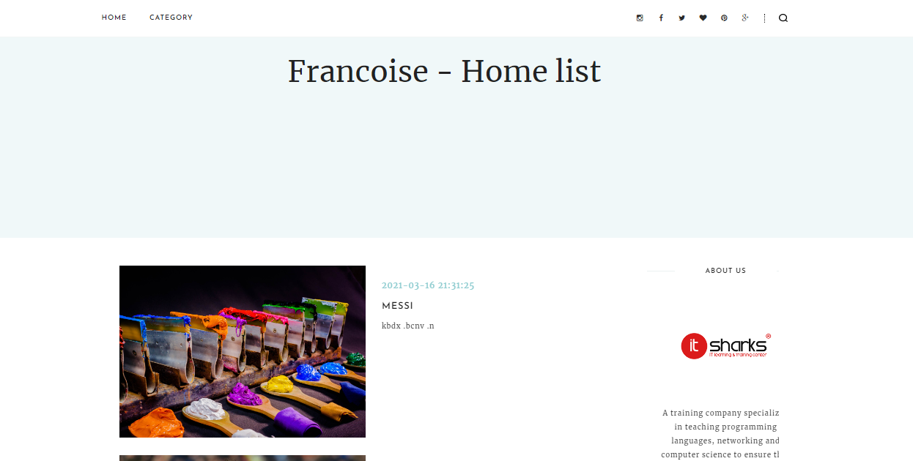
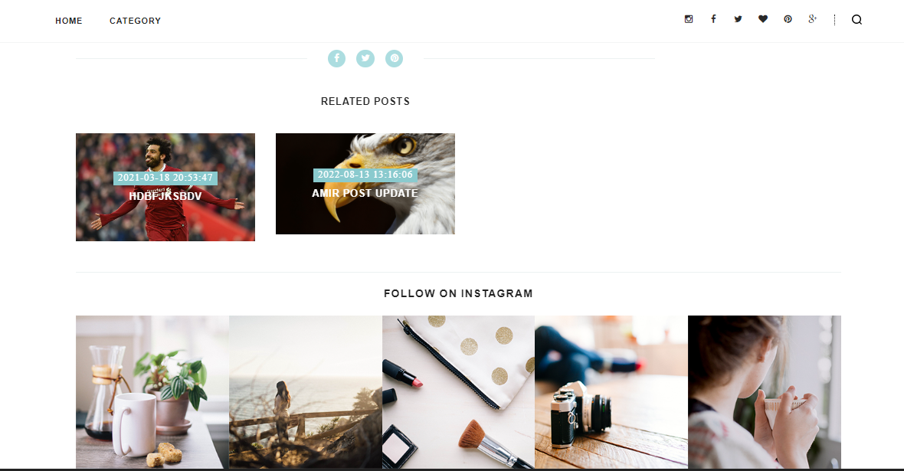

<h1>React Blog Project</h1>
<h3>in this project we're handling data send by API</h3>

<h4 class='text-info'>Our first API is getting posts in the home page</h4>

<h4 class='text-info'>and also the recent posts on the sidebar</h4>

<h4 class='text-info'>
    when clicking on any post it will send us to single page and handel our second api
    we take id and category every time we click on a post 
</h4>

<h4 class='text-info'>then if you scrolled down you can see a related posts with the same category you might need</h4>

<h4 class='text-info'>in the nav bar you can choose the category you want</h4>

<h4 class='text-info'>for saying, we choose sports then you'll see all sports posts </h4>
